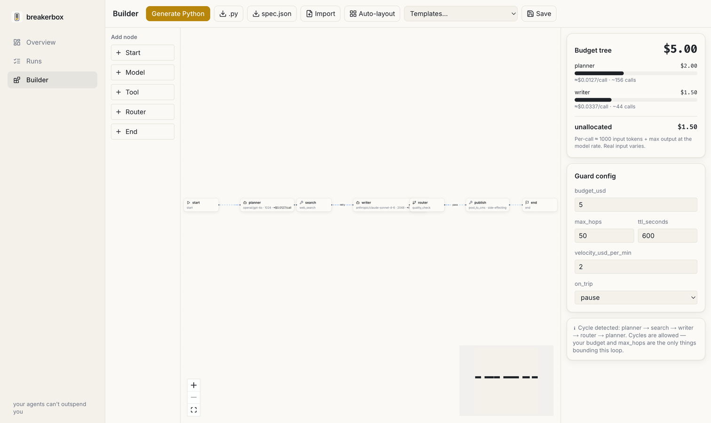

<p align="center">
  <picture>
    <source media="(prefers-color-scheme: dark)" srcset="docs/brand/logo-dark.svg">
    
  </picture>
</p>

<p align="center"><strong>The visual agent builder that can't be hacked into — because there's nothing to hack.</strong></p>

<p align="center">No server execution&nbsp;·&nbsp;No stored keys&nbsp;·&nbsp;Codegen only</p>

<p align="center"><code>pip install breakerbox</code></p>

<p align="center">
  <a href="https://marketing-coral-eight.vercel.app/"><strong>🔗 Live site</strong></a>&nbsp;·&nbsp;<a href="#the-demo"><strong>The demo&nbsp;↓</strong></a>&nbsp;·&nbsp;<a href="#quickstart"><strong>Quickstart&nbsp;↓</strong></a>
</p>

<p align="center">
  <a href="https://github.com/Amitcoh1/agentbreaker/actions/workflows/ci.yml"></a>
  <a href="LICENSE"></a>
  
  <a href="https://github.com/Amitcoh1/agentbreaker/stargazers"></a>
</p>

<p align="center">
  
</p>

Prototype anywhere; ship with **Breakerbox**. You draw a workflow on a canvas, and it generates
plain, editable LangGraph **Python** you download and run yourself — wrapped in `guard()`, a
hierarchical dollar budget that stops runaway loops at a hop boundary and writes a receipt of
exactly where the money went. In the [bundled demo](#the-demo), a runaway retry loop that burns
**$12.63** unguarded stops at **$0.82** under `guard()`. Three things make it different:

1. **Zero attack surface — codegen only.** No endpoint ever executes your flows; no provider
   key is ever stored or transmitted. There's nothing on our side to compromise. (See
   [Why no Run button?](#why-no-run-button))
2. **Budget-first.** The only builder where hierarchical budget escrow, trip rules, and
   side-effect tagging are part of the canvas itself.
3. **Code you own.** The output is readable, hand-editable Python — scaffolding, not a walled
   garden.

> **Breakerbox** is the product; the Python package is **`breakerbox`** (`pip install
> breakerbox`). The import, CLI, and API names are unchanged.

## Contents

- [Quickstart](#quickstart)
- [The demo](#the-demo)
- [What it actually does](#what-it-actually-does)
- [Build it visually](#build-it-visually)
- [Why no Run button?](#why-no-run-button)
- [How it compares](#how-it-compares-facts-only)
- [Notes & limitations](#notes--limitations-read-before-you-rely-on-it)
- [Cloud dashboard (optional)](#cloud-dashboard-optional)
- [Roadmap](#roadmap)
- [Contributing](#contributing)
- [License](#license)

## Quickstart

```bash
pip install breakerbox
```

Wrap the compiled LangGraph app you already have — the call site doesn't change:

```python
from breakerbox import guard

app = guard(
    my_langgraph_app,
    budget_usd=5.00,           # hard ceiling for the whole workflow DAG
    max_hops=50,               # total model/tool steps across all branches
    ttl_seconds=600,           # wall-clock limit
    velocity_usd_per_min=2.0,  # trip if the burn rate spikes
    on_trip="pause",           # "pause" | "kill"
)

result = app.invoke(inputs)    # the same call you already make
```

Every model and tool dispatch inside the graph — including sub-agents and subgraphs —
inherits one real-dollar budget. When a limit trips, the workflow stops **at the next hop
boundary** (never mid-call) and drops a shareable HTML receipt. No proxy, no Docker, no
gateway to run: enforcement lives *inside* your process, so there's no direct-call bypass.

Prefer to start on the canvas? Open the builder, draw the graph, and let it write this for you:

```bash
cd cloud/dashboard && npm install && npm run dev   # http://localhost:3000/builder
```

## The demo

A broken retry loop that never drops its context, so each hop costs more than the last
([`examples/runaway_demo`](examples/runaway_demo)) — no API keys required:

```
==============================================================
  UNGUARDED runaway : ran 60 hops, spent $12.63
  GUARDED           : killed early, spent $0.82  (budget $0.90)
  AVERTED           : $11.81
==============================================================
```

It stops **strictly under budget** — because the model declares a real `max_tokens`, the
reserve estimate is a true upper bound, so the call that would cross the line is blocked
before it runs. Every run also writes a self-contained `report.html`:

```
────────────────────────────────────────────────────────
 breakerbox receipt · killed (budget)
 stopped at $0.8157   budget $0.9000   hops 13
 projected (naive linear extrapolation, likely an underestimate): $3.13
────────────────────────────────────────────────────────
```

(See [`sample_receipt.html`](examples/runaway_demo/sample_receipt.html) for the full HTML.)

## What it actually does

- **Hierarchical budget escrow.** Not a flat session counter. A parent sub-allocates budget
  to child agents; a child can never spend beyond its allocation; a parent's remaining is
  `budget − Σ(child allocations) − own spend`. Accounting is reserve → execute → reconcile
  (a credit-card hold), so parallel branches can't race past the ceiling. Concurrency-safe
  and property-tested (`Σ spent + Σ reserved ≤ root budget`, always).
- **Graceful trip actions.**
  - `pause` — checkpoints via LangGraph's native checkpointer and raises `BudgetPaused`;
    `app.resume(checkpoint_id, extra_budget_usd=...)` continues from where it stopped.
  - `kill` — stops, finalizes the receipt, raises `BudgetKilled` listing which
    **side-effecting** tools already fired (so you can compensate).
- **Self-metering.** Counts input tokens locally (tiktoken) and meters streamed output
  chunks, then reconciles against the provider's reported usage and flags discrepancies —
  never trusts a single `usage` field, never meters an unknown model as `$0`. If a call ran
  without `max_tokens` and the cap landed one hop late, the receipt flags that hop explicitly.
- **The receipt.** Terminal summary + single-file `report.html` (inline CSS/SVG, no JS, no
  external assets) + JSON. Leads with the indisputable number — **stopped at $Y, budget $Z** —
  with the projection as clearly-labelled fine print.

## Build it visually

[`cloud/dashboard/app/builder`](cloud/dashboard/app/builder) is a drag-and-drop canvas
(model / tool / router / start / end nodes) with a live **Budget Tree** — root budget →
per-node allocations → unallocated remainder. Over-allocate and it turns red and **blocks
export**. Hit **Generate** and you get the guarded Python above, ready to copy or download.
Everything runs in your browser; the spec → Python codegen is shared with the `breakerbox
build spec.json` CLI and locked to it by golden-fixture tests (Python and TS, enforced in CI).

**AI suggest (bring your own key).** Any model/tool/router node has an optional "Suggest code"
helper: describe the step, and it drafts a Python body for you to copy in. It calls the model
**directly from your browser with your own API key** — the key is stored only in your browser
and sent only to the provider, never to a Breakerbox server (there is no server in this path).
Anthropic supports browser-direct calls; OpenAI blocks browser CORS, so for OpenAI you point the
base URL at your own CORS-enabled proxy. The suggestion is copy-paste scaffolding — it's never
written into the saved graph, so codegen stays deterministic.

## Why no Run button?

Server-side flow builders that run your graphs and hold your provider keys have been a
repeated remote-code-execution target. In Langflow (the category leader, ~100k+ GitHub
stars, IBM/DataStax-backed) the pattern is well documented and public:

- **CVE-2025-3248** (CVSS 9.8) — unauthenticated RCE via a code-validation endpoint that
  passed user input to `exec()`; on CISA's KEV list, used to deploy the Flodrix botnet.
- **CVE-2025-34291** (CVSS 9.4) — an account-takeover chain that also **exfiltrates the API
  keys stored in a workspace**; on CISA KEV, used by the MuddyWater APT for initial access.
- **CVE-2026-33017** (CVSS 9.8) — unauthenticated RCE via the public flow-build endpoint;
  on CISA KEV, weaponized within ~20 hours of disclosure to drop cryptominers.
- **CVE-2026-5027** (CVSS 8.8) — path-traversal RCE via file upload, with ~7,000 exposed
  instances observed under active exploitation.

This isn't a knock on Langflow's product — it's an architectural fact: **a server that runs
your flows and holds your keys is a high-value target.** Breakerbox removes the target. The
canvas only ever produces a Python *string* you run yourself, and your API keys live in your
own environment — never in a dashboard, database, or edge function. There's no endpoint to
exploit because no endpoint executes anything. That's the trade: you give up one-click cloud
runs, and in exchange there is nothing to breach. **Prototype in a tool like Langflow if you
like; ship the production-safe version here.**

## How it compares (facts only)

| | Langflow | LiteLLM budgets | Breakerbox |
|---|:---:|:---:|:---:|
| Visual graph building | ✅ rich | — | ✅ budget-first |
| Server executes your flows | ✅ *(attack surface)* | n/a | ❌ by design |
| Stores your provider keys | ✅ | ✅ *(proxy)* | ❌ never |
| Hierarchical per-agent dollar escrow | — | — *(flat session)* | ✅ |
| Graceful pause/resume at a hop boundary | — | — *(hard error)* | ✅ |
| Catches a runaway run *under* the org ceiling | — | — *(never fires)* | ✅ |
| Output is plain, editable Python | partial *(export)* | n/a | ✅ core promise |

LiteLLM/Portkey/Kong-style gateways solve a different layer (org-wide per-key spend) and
compose fine alongside this — the gateway caps the org, Breakerbox governs one workflow's
internal structure.

**The catch most gateway users miss:** a key limit has to sit high enough not to block real work,
so a single runaway run can burn **$180 while still *under* a $500 ceiling** — the key never fires
until the damage is already account-wide, and then it 429s everyone. Breakerbox trips that one run
at $2, at a hop boundary. *A key limit is the fuse box for the building; Breakerbox is the breaker on
this circuit.*

**vs LiteLLM / vs Langflow, in one line:** a gateway like **LiteLLM** guards the *key* — one flat
ceiling, blind to a single run's internal structure. A builder like **Langflow** *runs* your flow —
server-side, holding your keys. **Breakerbox guards the *workflow* and runs nothing:** a hierarchical
per-agent budget baked into plain Python you own. Prototype with either; ship the guarded version here.

Every claim above maps to a public, verifiable fact.

## Notes & limitations (read before you rely on it)

- **`on_trip="pause"` needs a checkpointer.** Compile your graph with one
  (`.compile(checkpointer=MemorySaver())`); `guard()` raises if it's missing.
- **The overshoot rule:** the guard never interrupts a call mid-flight. If your model has
  **no** `max_tokens`, the reserve estimate can under-count and the cap is enforced one hop
  late (overshoot bounded by a single call) — the receipt flags that hop. Set `max_tokens`
  and it stops strictly under budget.
- **Prices** (`prices.json`, ~2000 models) are sourced from LiteLLM's community-maintained
  price table. Refresh them any time with `breakerbox update-prices` (bundled table is the
  offline fallback). Still spot-check the models you care about. Override per-model or set
  `unknown_model="default_rate"` to meter unknown models at a conservative rate instead of
  failing.

## Cloud dashboard (optional)

Everything above works with zero cloud. If you want a shared, **live** view of runs, point
the guard at a Supabase-backed dashboard:

```python
app = guard(my_app, budget_usd=5.00, report_to="https://YOUR_REF.functions.supabase.co/ingest")
```

Events stream to the dashboard as the run executes (best-effort and non-blocking — a cloud
outage never affects the run); each run gets a shareable, unlisted URL with a live timeline.

To keep runs **private to your account**, sign in to the dashboard, create a key under
**Settings → Your ingest key**, and set it where your agents run:

```bash
export BREAKERBOX_INGEST_KEY="abk_…"   # from the dashboard; runs become private to you
```

Without a personal key the legacy shared key still works and runs stay public (shareable link).
Deploy runbook and code in [`cloud/`](cloud) (Supabase + Next.js on Vercel).

## Roadmap

Where this is headed — horizons, what we will and won't build — is public in
[`ROADMAP.md`](ROADMAP.md). The codegen-only, no-stored-keys architecture is a permanent
constraint, not a phase.

## Contributing

Issues and PRs welcome. Good first stops: the open [issues](https://github.com/Amitcoh1/agentbreaker/issues)
and the [`ROADMAP.md`](ROADMAP.md) horizons. To work on it locally:

```bash
pip install -e ".[dev]"
pytest -q          # pricing, ledger (+ hypothesis), tripwire, meter, guard, report, sink
ruff check .
```

The dashboard (`cloud/dashboard`) has its own checks: `npm run typecheck`, `npm run lint`,
`npm test` (codegen + price-table parity), `npm run build`. CI runs both suites on every push.

## License

[MIT](LICENSE)
